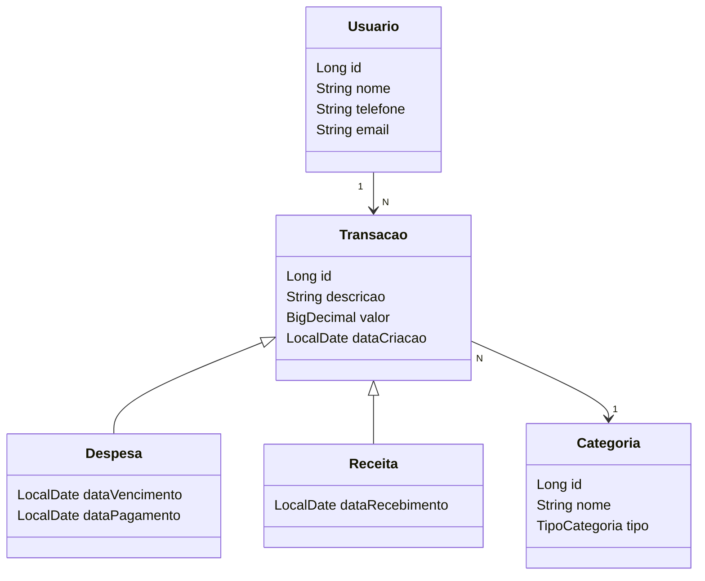
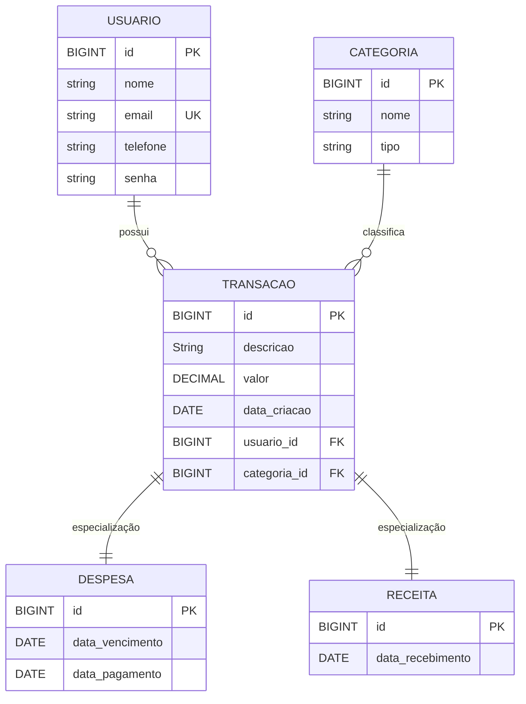
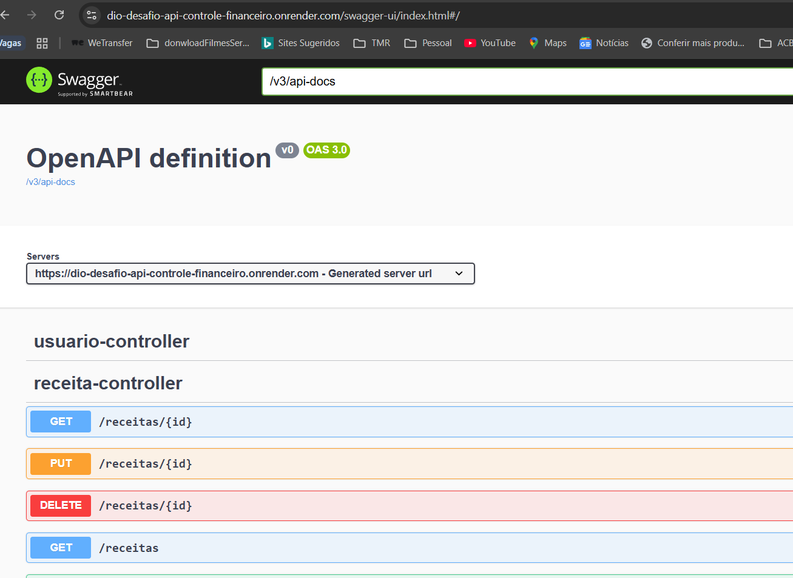

# 📊 FinControl API - Controle Financeiro Pessoal


API REST desenvolvida como desafio de **Deploy em Produção** do Bootcamp DIO + Santander, com foco em **arquitetura limpa, boas práticas e documentação via Swagger**.

🔗 **Link Produção:**  
- 🌍 API: [https://dio-desafio-api-controle-financeiro.onrender.com](https://dio-desafio-api-controle-financeiro.onrender.com)  
- 📑 Swagger UI: [https://dio-desafio-api-controle-financeiro.onrender.com/swagger-ui/index.html](https://dio-desafio-api-controle-financeiro.onrender.com/swagger-ui/index.html)

---

## 🗂️ Estrutura de Pacotes

```
src/main/java/com/santander/dio/fincontrol
├── controller
│   ├── UsuarioController
│   ├── CategoriaController
│   ├── ReceitaController
│   ├── DespesaController
│   └── UsuarioTransacaoController
│
├── dto
│   ├── request
│	│	├── UsuarioRequest
│	│	├── CategoriaRequest
│	│	├── DespesaRequest
│	│	├── ReceitaRequest
│	│	└── TransacaoRequest
│	│
│   └── response
│		├── UsuarioResponse
│		├── CategoriaResponse
│		├── DespesaResponse
│		├── ReceitaResponse
│		└── TransacaoResponse
│
├── model
│   ├── Usuario
│   ├── Categoria
│   ├── Transacao (abstract)
│   ├── Receita (extends Transacao)
│   └── Despesa (extends Transacao)
│
├── repository
│   ├── UsuarioRepository
│   ├── CategoriaRepository
│   └── TransacaoRepository
│
├── service
│   ├── UsuarioService
│   ├── CategoriaService
│   ├── ReceitaService
│   ├── DespesaService
│   └── TransacaoService
│
├── exception
│   ├── RecursoNaoEncontradoException
│   └── GlobalExceptionHandler (⚠️ ver notas abaixo "Observações Importantes")
│
└── utils
    └── TipoCategoria (enum)
```

### 🔑 Padrões Aplicados
- **MVC** (Model-View-Controller)  
- **DTO Pattern** (Request/Response isolados do domínio)  
- **Repository Pattern** (camada de persistência desacoplada)  
- **Service Layer** (regras de negócio centralizadas)  
- **Herança & Abstração**: `Transacao` como classe pai de `Receita` e `Despesa`  
- **Enum** para `TipoCategoria` e `TipoTransacao`

---

## 📐 Modelagem UML



---

## 📃 Modelo Entidade Relacionamento - MER



---

## 🚀 Endpoints

### 👤 Usuários
- `POST /usuarios`
- `GET /usuarios/{id}`
- `GET /usuarios`
- `PUT /usuarios/{id}`
- `DELETE /usuarios/{id}`

### 🏷️ Categorias
- `POST /categorias`
- `GET /categorias/{id}`
- `GET /categorias/tipo/{tipo}`
- `GET /categorias`
- `PUT /categorias/{id}`
- `DELETE /categorias/{id}`

### 💰 Receitas
- `POST /receitas`
- `GET /receitas/{id}`
- `GET /receitas`
- `PUT /receitas/{id}`
- `DELETE /receitas/{id}`

### 📉 Despesas
- `POST /despesas`
- `GET /despesas/{id}`
- `GET /despesas`
- `PUT /despesas/{id}`
- `DELETE /despesas/{id}`

### 🔎 Transações do Usuário
- `GET /usuarios/{id}/transacoes`
- `GET /usuarios/{id}/transacoes?inicio=2025-01-01&fim=2025-01-31`
- `GET /usuarios/{id}/transacoes/totais`

---

## 📸 Swagger UI



---

## 📄 Exemplo JSON (Receita)

```json
{
  "descricao": "Salario Agosto-2025",
  "valor": 2700,
  "dataCriacao": "2025-08-05",
  "usuarioId": 1,
  "categoriaId": 1,
  "dataRecebimento": "2025-08-05"
}
```

---

## ⚠️ Observações Importantes

- 🟡 O **Railway** foi o provedor sugerido, porém devido ao fim do saldo gratuito utilizei o **Render**. A experiência de deploy foi idêntica, garantindo ambiente **produtivo estável**.  
- 🟡 O **Swagger** apresentou incompatibilidade com o `GlobalExceptionHandler`. Para manter a **usabilidade via Swagger UI**, a classe global de exceções foi comentada temporariamente. (Evolução futura: ajuste para compatibilidade ou uso de `springdoc-openapi`).
- 🟢 O projeto já conta com **CI/CD automatizado via Render**, com integração direta ao GitHub. Cada commit na branch principal dispara automaticamente build + deploy em produção.  

---

## 🔮 Possíveis Evoluções

- Implementar **autenticação e autorização** (JWT + Spring Security)  
- Adicionar **testes unitários e de integração** (JUnit, Mockito) integrados ao pipeline CI/CD  
- Criar relatórios financeiros exportáveis (CSV, PDF)  
- Melhorar a **observabilidade** (Micrometer + Prometheus + Grafana)
  
---

## 🧑‍💻 Autor

**André Luiz de Oliveira**  
💼 Desenvolvedor Back-end Java | Spring Boot | APIs REST  
📍 Brasil  
🔗 [LinkedIn](https://www.linkedin.com/in/andre-oliveira-a9a4281b0/) | [GitHub](https://github.com/AndreOliveiraALO)

---

MIT License © 2025
