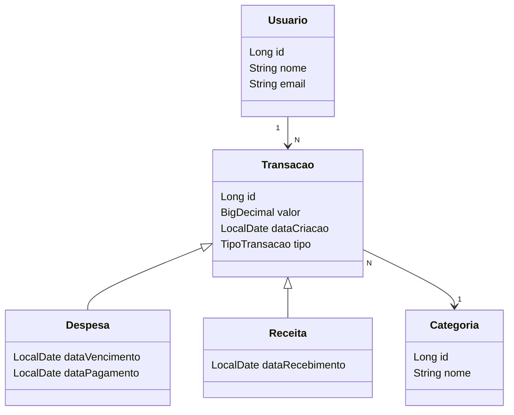
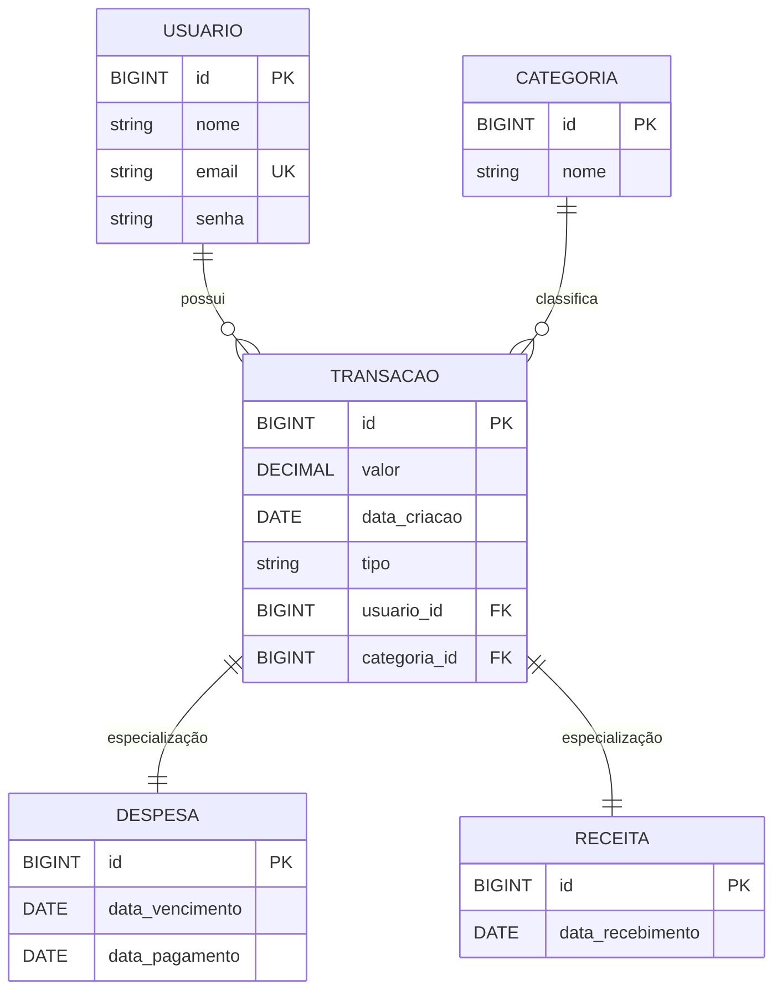

# dio-desafio-api-controle-financeiro-pessoal

## Diagrama de classe

```mermaid
classDiagram
    class Transacao {
        Long id
        BigDecimal valor
        LocalDate dataCriacao
        TipoTransacao tipo
    }

    class Despesa {
        LocalDate dataVencimento
        LocalDate dataPagamento
    }

    class Receita {
        LocalDate dataRecebimento
    }

    class Usuario {
        Long id
        String nome
        String email
    }

    class Categoria {
        Long id
        String nome
    }

    Transacao <|-- Despesa
    Transacao <|-- Receita
    Usuario "1" --> "N" Transacao
    Transacao "N" --> "1" Categoria
```

## Modelo Entidade Relacionamento - MER

```mermaid
---
config:
  layout: dagre
---
erDiagram
	direction TB
	USUARIO {
		BIGINT id PK ""  
		string nome  ""  
		string email UK ""  
		string senha  ""  
	}
	TRANSACAO {
		BIGINT id PK ""  
		DECIMAL valor  ""  
		DATE data_criacao  ""  
		string tipo  ""  
		BIGINT usuario_id FK ""  
		BIGINT categoria_id FK ""  
	}
	CATEGORIA {
		BIGINT id PK ""  
		string nome  ""  
	}
	DESPESA {
		BIGINT id PK ""  
		DATE data_vencimento  ""  
		DATE data_pagamento  ""  
	}
	RECEITA {
		BIGINT id PK ""  
		DATE data_recebimento  ""  
	}
	USUARIO||--o{TRANSACAO:"possui"
	CATEGORIA||--o{TRANSACAO:"classifica"
	TRANSACAO||--||DESPESA:"especialização"
	TRANSACAO||--||RECEITA:"especialização"

```

