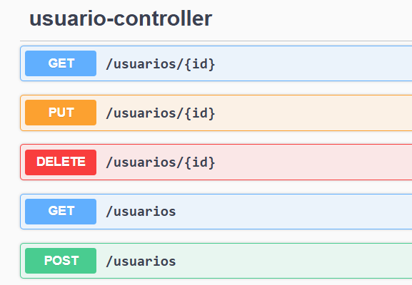
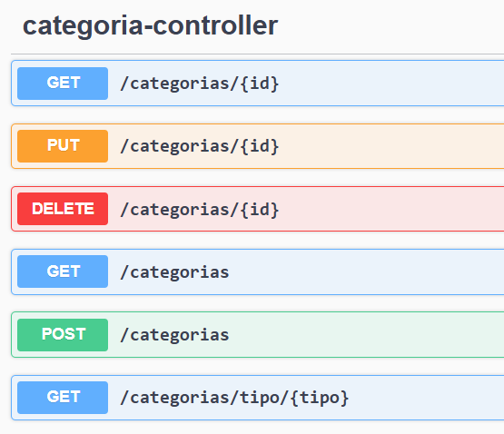
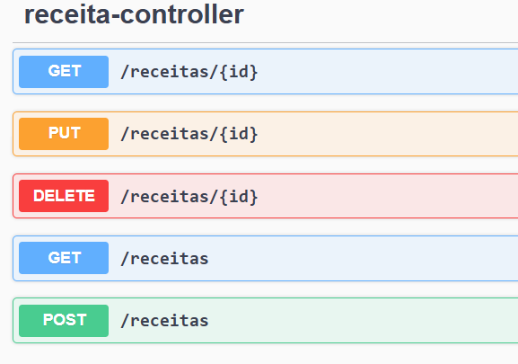
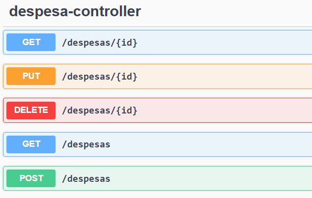
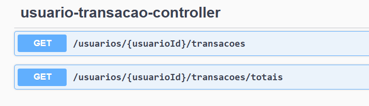

# 📊 FinControl API

## 📸 Prints e Exemplos de Uso

- Tela inicial do Swagger:  
  

- Endpoints de Usuário:  
  

- Endpoints de Categoria:  
  

- Endpoints de Receita:  
  

- Endpoints de Despesa:  
  

- Endpoints de Usuário transação:  
  

### Exemplos JSON

- [Requisição Usuário](./docs/exemplos-json/usuario-request.json)  
- [Resposta Usuário](./docs/exemplos-json/usuario-response.json)  
- [Requisição Categoria](./docs/exemplos-json/categoria-request.json)  
- [Resposta Categoria](./docs/exemplos-json/categoria-response.json)  
- [Lista de Transações](./docs/exemplos-json/transacao-list.json)  
- [Relatório Financeiro](./docs/exemplos-json/relatorio-financeiro.json)  
